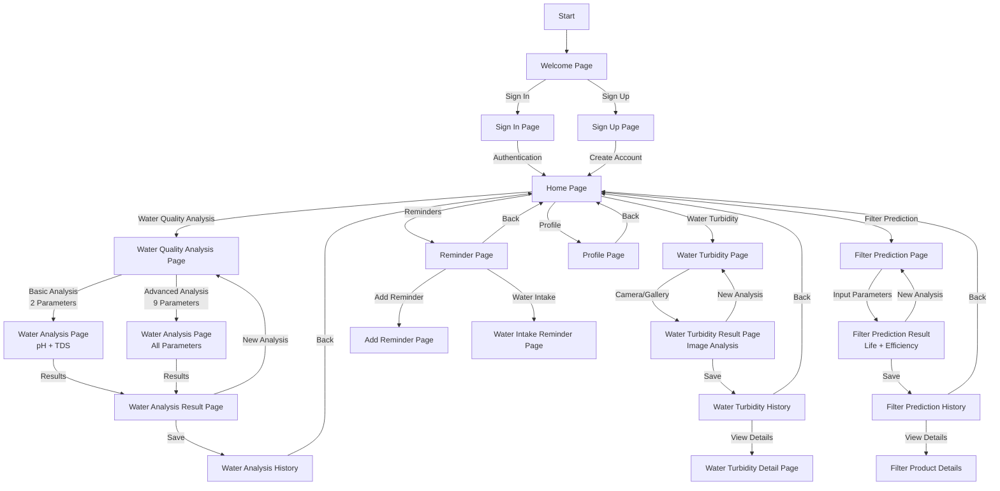

# System Architecture and Navigation Flow Diagrams

## 1. System Architecture Diagram

```mermaid
graph TB
    subgraph "Frontend Layer"
        A[Flutter Mobile App]
        A1[UI Components]
        A2[State Management]
        A3[API Client]
        A4[Local Storage]
        A5[Error Handling]
        A6[Form Validation]
        A7[Image Processing]
        A8[TFLite Integration]
    end

    subgraph "Backend Layer"
        B[Flask API Server]
        B1[Data Validation]
        B2[Error Handling]
        B3[CORS Middleware]
        B4[Request Processing]
        B5[Response Formatting]
    end

    subgraph "ML Processing Layer"
        C[Water Potability Models]
        C1[2-Feature Model<br/>pH + TDS]
        C2[9-Feature Model<br/>All Parameters]
        C3[Data Scaler]
        C4[Prediction Engine]
        
        D[Water Turbidity Model]
        D1[Enhanced NTU Model<br/>Image Classification]
        D2[Image Preprocessing]
        D3[NTU Estimation]
        
        E[Filter Health Models]
        E1[Filter Life Model<br/>TFLite]
        E2[Filter Efficiency Model<br/>TFLite]
        E3[Health Calculator]
    end

    subgraph "Data Storage"
        F[Firebase]
        F1[Authentication]
        F2[Firestore]
        F3[User Profiles]
        F4[Analysis History]
        F5[Image Storage]
    end

    %% Data Flow
    A -->|HTTP Requests| B
    B -->|Process Data| C
    C -->|Return Predictions| B
    B -->|JSON Response| A
    
    A -->|Image Analysis| D
    D -->|NTU Results| A
    
    A -->|Filter Prediction| E
    E -->|Health Results| A
    
    A -->|User Data| F
    F -->|Auth State| A

    %% Component Details
    A1 -->|User Input| A3
    A2 -->|State Updates| A1
    A6 -->|Validated Input| A3
    A7 -->|Image Capture| A8
    A8 -->|TFLite Models| D
    A8 -->|TFLite Models| E
    
    B1 -->|Validated Data| B4
    B4 -->|Processed Data| B5
    C1 -->|Scaled Data| C3
    C2 -->|Scaled Data| C3
    D1 -->|Image Input| D2
    D2 -->|Processed Image| D3
    E1 -->|Water Quality| E3
    E2 -->|Water Quality| E3
    
    F1 -->|Auth Token| A
    F2 -->|User Data| A
    F3 -->|Profile Updates| A
    F4 -->|History Data| A
    F5 -->|Images| A
```

## 2. Navigation Flow Diagram

## 3. Model Architecture Overview

### 3.1 Water Potability Prediction Models

#### A. 2-Feature Water Potability Model
- **Parameters**: pH and TDS (Total Dissolved Solids)
- **Model File**: `water_potability_model_2features_optimized.pkl`
- **Scaler**: `water_potability_scaler_2features_optimized.pkl`
- **API Endpoint**: `/predict`
- **Use Case**: Quick water quality assessment with minimal parameters

#### B. 9-Feature Water Potability Model
- **Parameters**: pH, TDS, Hardness, Solids, Chloramines, Sulfate, Conductivity, Organic Carbon, Trihalomethanes
- **Model File**: `water_potability_model_9features_relaxed_labeling.pkl`
- **Scaler**: `water_potability_scaler_9features_relaxed_labeling.pkl`
- **API Endpoint**: `/predict_9features`
- **Use Case**: Comprehensive water quality analysis with relaxed labeling

### 3.2 Water Turbidity Classification Model

#### A. Enhanced NTU Model
- **Model Type**: Image Classification (TFLite)
- **Model File**: `enhanced_ntu_model.tflite`
- **Input**: 224x224 RGB images
- **Output Classes**: 5 NTU levels
  - Below 1 NTU (Clear water)
  - Around 30 NTU (Moderately turbid)
  - Around 90 NTU (Significantly turbid)
  - Around 150 NTU (Highly turbid)
  - WaterCup (Not a turbidity class)
- **Processing**: Image preprocessing with ImageNet normalization
- **Use Case**: Real-time turbidity assessment from water images

### 3.3 Filter Health Prediction Models

#### A. Filter Life Span Prediction Model
- **Model Type**: Regression (TFLite)
- **Model File**: `filter_life_model.tflite`
- **Input Parameters**: TDS, Turbidity, pH, Depth, Flow Rate
- **Output**: Predicted filter life in hours
- **Use Case**: Predict when filter replacement is needed

#### B. Filter Efficiency Prediction Model
- **Model Type**: Regression (TFLite)
- **Model File**: `filter_efficiency_model.tflite`
- **Input Parameters**: TDS, Turbidity, pH, Depth, Flow Rate
- **Output**: Filter efficiency percentage
- **Use Case**: Monitor filter performance degradation

## 4. Component Descriptions

### Frontend Layer
- **Flutter Mobile App**: Cross-platform mobile application
- **UI Components**: Material Design widgets and custom components
- **State Management**: Manages application state and data flow
- **API Client**: Handles communication with the Flask backend
- **Local Storage**: Manages local data caching
- **Error Handling**: Client-side error management
- **Form Validation**: Input validation and user feedback
- **Image Processing**: Camera integration and image handling
- **TFLite Integration**: On-device machine learning inference

### Backend Layer
- **Flask API Server**: RESTful API endpoints for water quality analysis
- **Data Validation**: Input validation and sanitization
- **Error Handling**: Comprehensive error management
- **CORS Middleware**: Cross-origin resource sharing support
- **Request Processing**: Handles incoming requests
- **Response Formatting**: Standardizes API responses

### ML Processing Layer

#### Water Potability Models
- **2-Feature Model**: Basic water quality analysis (pH and TDS)
- **9-Feature Model**: Comprehensive water quality analysis
- **Data Scaler**: Normalizes input data for predictions
- **Prediction Engine**: Generates water quality predictions

#### Water Turbidity Model
- **Enhanced NTU Model**: Image-based turbidity classification
- **Image Preprocessing**: Resizes and normalizes images
- **NTU Estimation**: Calculates weighted NTU values

#### Filter Health Models
- **Filter Life Model**: Predicts filter lifespan
- **Filter Efficiency Model**: Predicts filter efficiency
- **Health Calculator**: Computes current filter health status

### Data Storage
- **Firebase**: Cloud-based backend services
- **Authentication**: User authentication and authorization
- **Firestore**: NoSQL database for storing analysis results
- **User Profiles**: Manages user information
- **Analysis History**: Stores past water quality analyses
- **Image Storage**: Stores water turbidity images

## 5. System Workflow

### 5.1 Water Quality Analysis Workflow
1. **User Input**: Manual parameter entry (2 or 9 parameters)
2. **Data Validation**: Range checking and format verification
3. **API Request**: HTTP POST to Flask backend
4. **Model Processing**: Feature scaling and prediction
5. **Result Generation**: Potability probability calculation
6. **Response**: JSON format with prediction results
7. **Data Storage**: Save results to Firestore
8. **User Feedback**: Visual results display

### 5.2 Water Turbidity Analysis Workflow
1. **Image Capture**: Camera or gallery selection
2. **Image Preprocessing**: Resize to 224x224 and normalize
3. **TFLite Inference**: Run enhanced NTU model
4. **Result Processing**: Calculate weighted NTU estimation
5. **Quality Assessment**: Determine water quality status
6. **Image Storage**: Upload to Firebase Storage
7. **Data Storage**: Save analysis to Firestore
8. **User Feedback**: Visual results with confidence levels

### 5.3 Filter Health Prediction Workflow
1. **Parameter Input**: Water quality and usage parameters
2. **Data Validation**: Range checking for all inputs
3. **TFLite Inference**: Run both life and efficiency models
4. **Health Calculation**: Compute current filter health
5. **Replacement Planning**: Calculate replacement timeline
6. **Data Storage**: Save prediction to Firestore
7. **User Feedback**: Health status and recommendations

## 6. Technical Implementation Details

### 6.1 Backend Services
- **Flask API Endpoints**:
  - `/predict` for 2-parameter analysis
  - `/predict_9features` for comprehensive analysis
- **CORS Support**: Cross-origin resource sharing
- **JSON Response Format**: Standardized API responses
- **Error Handling**: Comprehensive error management
- **Fallback Logic**: Mock predictions when models unavailable

### 6.2 Machine Learning Models
- **Model Files**:
  - `water_potability_model_2features_optimized.pkl`
  - `water_potability_model_9features_relaxed_labeling.pkl`
  - `enhanced_ntu_model.tflite`
  - `filter_life_model.tflite`
  - `filter_efficiency_model.tflite`
- **Corresponding Scalers**: Feature normalization for potability models
- **TFLite Integration**: On-device inference for turbidity and filter models

### 6.3 Mobile Application
- **Flutter Implementation**: Cross-platform compatibility
- **Responsive UI Design**: Material Design components
- **Real-time Processing**: Immediate model inference
- **User Data Management**: Firebase integration
- **Image Processing**: Camera and gallery integration
- **TFLite Support**: On-device machine learning

### 6.4 Data Management
- **Input Validation**: Range checking and format verification
- **Error Handling**: Comprehensive error management
- **User Feedback**: Real-time validation feedback
- **Data Persistence**: Firebase Firestore integration
- **Image Storage**: Firebase Storage for turbidity images

### 6.5 System Security
- **API Security**: CORS implementation and input validation
- **Authentication**: Firebase Authentication
- **Data Privacy**: User-specific data isolation
- **Secure Transmission**: HTTPS for all communications
- **Error Handling**: Secure error responses

## 7. Model Performance and Fallbacks

### 7.1 Model Availability Handling
- **Primary Models**: Optimized Random Forest and TFLite models
- **Fallback Logic**: Mock predictions when models unavailable
- **Error Recovery**: Graceful degradation with user feedback
- **Model Loading**: Dynamic model loading with error handling

### 7.2 Prediction Accuracy
- **Water Potability**: Probability-based classification with confidence scores
- **Water Turbidity**: Multi-class classification with NTU estimation
- **Filter Health**: Regression models with health percentage calculation
- **Validation**: Input range validation and realistic parameter checking

### 7.3 User Experience
- **Real-time Processing**: Immediate results for all analysis types
- **Visual Feedback**: Color-coded results and status indicators
- **Historical Data**: Comprehensive analysis history
- **Recommendations**: Actionable insights and maintenance suggestions

## 8. Proposed System Approach

### 8.1.1 Proposed System Approach
The proposed system adopts a client-server architecture, comprising a Flask-based backend and a Flutter-developed frontend, to provide an affordable and accessible solution for water quality monitoring and filter health prediction.

#### 8.1.1.1 System Architecture
The system is implemented as a client-server architecture with the following components:

**A. Backend (Flask Server)**
- RESTful API endpoints for water quality prediction
- Two water potability prediction models:
  - 2-feature model (pH and TDS)
  - 9-feature model (comprehensive water parameters)
- Input validation and error handling
- Model scaling and probability calculation
- Fallback logic for model unavailability

**B. Frontend (Flutter Application)**
- Cross-platform mobile application
- User-friendly interface for data entry and image capture
- Real-time prediction display for all model types
- Historical data visualization
- Filter health monitoring and prediction
- On-device TFLite model inference for turbidity and filter analysis

#### 8.1.1.2 Core Features
The system's core functionalities are designed to provide comprehensive and actionable water quality insights:

**A. Water Quality Prediction**
- Basic Analysis (2 parameters)
  - pH measurement
  - TDS (Total Dissolved Solids)
- Comprehensive Analysis (9 parameters)
  - pH, TDS, Hardness, Solids, Chloramines, Sulfate, Conductivity, Organic Carbon, Trihalomethanes

**B. Water Turbidity Classification**
- Image-based turbidity analysis using enhanced NTU model
- Real-time image processing and classification
- NTU value estimation with confidence levels
- Water quality status assessment based on turbidity levels

**C. Filter Health Prediction**
- Filter life span prediction based on water quality parameters
- Filter efficiency monitoring and prediction
- Health percentage calculation and replacement planning
- Maintenance recommendations and alerts

**D. Prediction Models**
- Machine Learning Implementation
  - Optimized Random Forest models for water potability
  - TFLite models for turbidity classification and filter health
  - Feature scaling for accurate predictions
  - Probability-based classification
  - Fallback logic for model unavailability

**E. Data Validation**
- Input Range Checking
  - pH: 0-14
  - Non-negative values for all parameters
  - Realistic parameter ranges
  - Image format and size validation
  - Error handling and user feedback

#### 8.1.1.3 Technical Implementation
The technical implementation details outline the specific technologies and methods used in the system's development:

**A. Backend Services**
- Flask API Endpoints
  - `/predict` for 2-parameter analysis
  - `/predict_9features` for comprehensive analysis
  - CORS support for cross-origin requests
  - JSON response format

**B. Machine Learning Models**
- Water Potability Models
  - `water_potability_model_2features_optimized.pkl`
  - `water_potability_model_9features_relaxed_labeling.pkl`
  - Corresponding scalers for feature normalization
- Water Turbidity Model
  - `enhanced_ntu_model.tflite` for image classification
  - 5-class NTU classification system
- Filter Health Models
  - `filter_life_model.tflite` for lifespan prediction
  - `filter_efficiency_model.tflite` for efficiency monitoring

**C. Mobile Application**
- Flutter Implementation
  - Cross-platform compatibility
  - Responsive UI design
  - Real-time data processing
  - User data management
  - TFLite integration for on-device inference
  - Image capture and processing capabilities

#### 8.1.1.4 System Workflow
The system workflow describes the step-by-step process from data collection to result generation:

**A. Water Quality Analysis Workflow**
- Data Collection
  - Manual parameter entry
  - Basic or comprehensive analysis selection
  - Data validation
- Data Processing
  - Parameter scaling
  - Model prediction
  - Probability calculation

**B. Water Turbidity Analysis Workflow**
- Image Collection
  - Camera capture or gallery selection
  - Image preprocessing and validation
- Image Processing
  - Resize to 224x224 pixels
  - ImageNet normalization
  - TFLite model inference
- Result Generation
  - NTU classification and estimation
  - Confidence level calculation
  - Water quality status assessment

**C. Filter Health Prediction Workflow**
- Parameter Input
  - Water quality parameters (TDS, Turbidity, pH)
  - Usage parameters (daily usage, installation date)
  - Filter specifications (depth, flow rate)
- Model Processing
  - TFLite model inference for life and efficiency
  - Health percentage calculation
  - Replacement timeline prediction

**D. Result Generation**
- Quality Assessment
  - Potability probability
  - Parameter analysis
  - Quality recommendations
  - Filter health status
- User Feedback
  - Visual results display
  - Quality indicators
  - Maintenance suggestions
  - Replacement alerts

#### 8.1.1.5 System Features
The system offers a range of features to cater to different user needs for water quality assessment:

**A. Prediction Capabilities**
- Basic Water Analysis
  - Quick water quality check
  - Essential parameter monitoring
  - Immediate results
- Comprehensive Water Analysis
  - Detailed water quality assessment
  - Multiple parameter analysis
  - Advanced quality prediction
- Turbidity Analysis
  - Real-time image-based assessment
  - NTU value estimation
  - Visual quality indicators
- Filter Health Monitoring
  - Life span prediction
  - Efficiency tracking
  - Maintenance planning

**B. User Interface**
- Input Forms
  - Parameter entry fields
  - Image capture interface
  - Validation feedback
  - Analysis type selection
- Results Display
  - Probability visualization
  - Quality indicators
  - Parameter breakdown
  - Health status monitoring

#### 8.1.1.6 Implementation Details
Further specifics on the implementation of the models, data handling, and security are outlined here:

**A. Model Integration**
- Machine Learning Models
  - Optimized Random Forest implementation for potability
  - TFLite models for turbidity and filter health
  - Feature scaling for accuracy
  - Probability-based classification
  - Fallback mechanisms

**B. Data Management**
- Input Validation
  - Range checking
  - Format verification
  - Error handling
  - User feedback
- Image Processing
  - Format validation
  - Size optimization
  - Preprocessing pipeline

**C. System Security**
- API Security
  - CORS implementation
  - Input validation
  - Error handling
  - Secure data transmission
- Data Privacy
  - User-specific data isolation
  - Secure image storage
  - Authentication requirements

### 8.1.2 Technique
This section explores alternative approaches considered for water quality monitoring and provides justification for selecting the manual input with AI analysis approach.

**A. Alternative Approaches Considered**
Several existing methodologies were evaluated for their applicability to this project, each with distinct advantages and limitations:

**IoT-Based Sensor Networks**
- Description: Continuous real-time monitoring using distributed sensors; automated data collection and transmission; cloud-based data storage and analysis; real-time alerts and notifications.
- Advantages: Continuous monitoring capability; high accuracy in measurements; automated data collection; real-time analysis and alerts.
- Limitations: High initial setup costs; complex maintenance requirements; dependency on power supply; limited accessibility in remote areas.
- Justification for Not Using: Cost-prohibitive for individual users; complex infrastructure requirements; not suitable for small-scale applications; high maintenance overhead.

**Laboratory-Based Analysis**
- Description: Professional water quality testing in controlled environments; advanced analytical equipment (ICP-MS, HPLC); certified testing procedures; comprehensive parameter analysis.
- Advantages: Highest accuracy in measurements; comprehensive parameter analysis; certified results; professional interpretation.
- Limitations: Time-consuming process; high cost per test; limited accessibility; delayed results.
- Justification for Not Using: Not suitable for regular monitoring; cost-prohibitive for frequent testing; results not immediately available; requires professional expertise.

**Colorimetric Test Kits**
- Description: Chemical-based color change indicators; visual comparison with standard charts; multiple parameter testing; portable testing solution.
- Advantages: Cost-effective; portable and easy to use; quick results; no power requirements.
- Limitations: Subjective interpretation; limited accuracy; chemical waste generation; limited parameter range.
- Justification for Not Using: Less accurate than digital methods; environmental concerns with chemical waste; subjective results interpretation; limited parameter coverage.

**Smartphone Sensor Integration**
- Description: External sensors connected to smartphones; mobile app-based analysis; cloud data storage; real-time results.
- Advantages: Portable solution; real-time analysis; user-friendly interface; data storage capabilities.
- Limitations: Additional hardware costs; compatibility issues; limited sensor accuracy; battery consumption.
- Justification for Not Using: Additional hardware dependency; higher cost than basic testers; compatibility challenges; limited user accessibility.

**B. Chosen Approach: Manual Input with AI Analysis**
The project's chosen approach, manual input with AI analysis, offers a balanced solution that addresses the limitations of other methods while maximizing accessibility and affordability.

**Implementation Method**
- Description: Manual data entry from basic testers; image capture for turbidity analysis; AI-powered analysis using multiple model types; cloud-based processing; mobile app interface with on-device inference.

**Advantages of Chosen Approach**
- Cost-Effective: Uses existing basic testers; no additional hardware required; minimal maintenance costs; affordable for individual users.
- Accessibility: Works with common testers; no special equipment needed; easy-to-use interface; available on mobile devices.
- Accuracy: AI-enhanced analysis; multiple parameter consideration; pattern recognition; anomaly detection; image-based turbidity assessment.
- User-Friendly: Simple data entry; clear result presentation; immediate feedback; easy-to-understand recommendations; visual turbidity analysis.

**Technical Implementation**
- Data Collection: Manual parameter entry; basic tester measurements; image upload capability; user input validation.
- Analysis Process: Machine learning models for potability; TFLite models for turbidity and filter health; pattern recognition; anomaly detection; quality prediction.
- Result Generation: Quality assessment; maintenance recommendations; trend analysis; alert generation; filter health monitoring.

**Justification for Chosen Approach**
- Practicality: Suitable for regular monitoring; easy to implement; low maintenance requirements; scalable solution.
- Cost-Effectiveness: Minimal initial investment; low operational costs; no additional hardware; affordable for users.
- Accuracy and Reliability: AI-enhanced analysis; multiple parameter consideration; pattern recognition; continuous improvement capability; image-based validation.
- User Accessibility: Simple to use; available on mobile devices; no technical expertise required; immediate results; visual analysis capabilities.

## 9. Experiment Measurements and Parameters

### 2.3.3 Experiment Measurements and Parameters
The following measurements and parameters will be used to evaluate the system and model performance:

**A. Water Quality Parameters**

**Basic Parameters (2-feature model)**
- pH (0-14 scale)
- TDS (Total Dissolved Solids)

**Comprehensive Parameters (9-feature model)**
- pH
- TDS
- Hardness
- Solids
- Chloramines
- Sulfate
- Conductivity
- Organic Carbon
- Trihalomethanes

**B. Water Turbidity Parameters**

**Image-Based Analysis**
- Image resolution and format validation
- NTU classification levels:
  - Below 1 NTU (Clear water)
  - Around 30 NTU (Moderately turbid)
  - Around 90 NTU (Significantly turbid)
  - Around 150 NTU (Highly turbid)
  - WaterCup (Not a turbidity class)
- Confidence scores for each NTU class
- Estimated NTU value calculation
- Water quality status assessment

**C. Filter Health Parameters**

**Input Parameters for Filter Models**
- TDS (Total Dissolved Solids)
- Turbidity
- pH
- Filter depth
- Flow rate
- Daily usage hours
- Installation date

**Output Parameters**
- Predicted filter life (hours)
- Filter efficiency percentage
- Current health percentage
- Replacement timeline
- Maintenance recommendations

**D. Model Performance Metrics**

**Water Potability Models**
- Accuracy
- Precision
- Recall
- F1 Score
- ROC-AUC Score
- Probability calibration
- Feature importance analysis

**Water Turbidity Model**
- Classification accuracy
- Per-class precision and recall
- Confusion matrix analysis
- NTU estimation accuracy
- Confidence score reliability
- Image preprocessing validation

**Filter Health Models**
- Regression accuracy (R² score)
- Mean Absolute Error (MAE)
- Mean Squared Error (MSE)
- Root Mean Squared Error (RMSE)
- Prediction interval analysis
- Model stability assessment

**E. System Performance Metrics**

**Response Time**
- API endpoint response time
- TFLite model inference time
- Image processing time
- Database query performance
- Overall system latency

**Processing Speed**
- Model loading time
- Batch processing capability
- Real-time analysis performance
- Image preprocessing efficiency
- Data validation speed

**User Error Rate**
- Input validation error rate
- Image capture success rate
- Parameter entry accuracy
- User interface error frequency
- Data submission success rate

**System Reliability**
- Model availability rate
- Fallback mechanism effectiveness
- Error recovery success rate
- System uptime
- Data consistency

**Data Accuracy**
- Input parameter validation accuracy
- Model prediction reliability
- Historical data consistency
- Image analysis accuracy
- Filter health prediction precision

**F. User Experience Metrics**

**Interface Performance**
- App loading time
- Navigation responsiveness
- Form completion rate
- Image capture success rate
- Result display clarity

**User Satisfaction**
- Ease of use assessment
- Result understanding rate
- Feature utilization rate
- User retention rate
- Feedback and rating scores

**G. Technical Performance Metrics**

**Mobile Application**
- Memory usage optimization
- Battery consumption
- Storage efficiency
- Cross-platform compatibility
- Offline functionality

**Backend Services**
- API endpoint reliability
- CORS implementation effectiveness
- Error handling coverage
- Security validation success
- Scalability performance

**Data Management**
- Firebase integration reliability
- Data synchronization accuracy
- Image storage efficiency
- User data privacy compliance
- Backup and recovery success

**H. Model-Specific Evaluation Criteria**

**Water Potability Models**
- Feature scaling effectiveness
- Model generalization capability
- Overfitting/underfitting assessment
- Cross-validation performance
- Real-world applicability

**Water Turbidity Model**
- Image preprocessing accuracy
- Classification threshold optimization
- Multi-class classification performance
- NTU estimation precision
- Visual quality assessment accuracy

**Filter Health Models**
- Regression model accuracy
- Prediction confidence intervals
- Feature correlation analysis
- Model interpretability
- Maintenance recommendation accuracy

**I. Integration Performance Metrics**

**Model Integration**
- TFLite model loading reliability
- On-device inference performance
- Model switching efficiency
- Fallback mechanism effectiveness
- Error propagation handling

**Data Flow Performance**
- End-to-end processing time
- Data transformation accuracy
- Result aggregation efficiency
- Historical data retrieval speed
- Real-time update performance

**J. Quality Assurance Metrics**

**Data Quality**
- Input parameter range validation
- Image quality assessment
- Data completeness rate
- Consistency checking accuracy
- Anomaly detection effectiveness

**System Quality**
- Error logging completeness
- Debug information accuracy
- Performance monitoring coverage
- Security audit compliance
- Documentation accuracy 