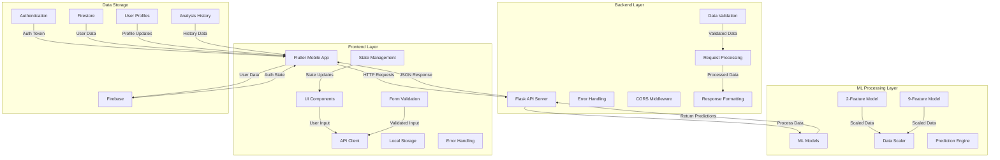
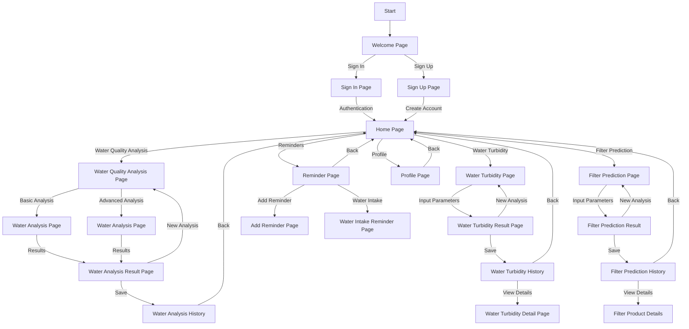

# System Architecture and Navigation Flow Diagrams

## 1. System Architecture Diagram

## 2. Navigation Flow Diagram

## Component Descriptions

### Frontend Layer
- **Flutter Mobile App**: Cross-platform mobile application
- **UI Components**: Material Design widgets and custom components
- **State Management**: Manages application state and data flow
- **API Client**: Handles communication with the Flask backend
- **Local Storage**: Manages local data caching
- **Error Handling**: Client-side error management
- **Form Validation**: Input validation and user feedback

### Backend Layer
- **Flask API Server**: RESTful API endpoints for water quality analysis
- **Data Validation**: Input validation and sanitization
- **Error Handling**: Comprehensive error management
- **CORS Middleware**: Cross-origin resource sharing support
- **Request Processing**: Handles incoming requests
- **Response Formatting**: Standardizes API responses

### ML Processing Layer
- **ML Models**: Pre-trained machine learning models
- **2-Feature Model**: Basic water quality analysis (pH and TDS)
- **9-Feature Model**: Comprehensive water quality analysis
- **Data Scaler**: Normalizes input data for predictions
- **Prediction Engine**: Generates water quality predictions

### Data Storage
- **Firebase**: Cloud-based backend services
- **Authentication**: User authentication and authorization
- **Firestore**: NoSQL database for storing analysis results
- **User Profiles**: Manages user information
- **Analysis History**: Stores past water quality analyses

### Navigation Flow
1. **Authentication**
   - Welcome Page
   - Sign In Page
   - Sign Up Page

2. **Main Features**
   - Water Quality Analysis
     - Basic Analysis (2-feature)
     - Advanced Analysis (9-feature)
     - Results Display
     - Analysis History
   - Water Turbidity Analysis
     - Input Parameters
     - Results Display
     - History and Details
   - Filter Prediction
     - Input Parameters
     - Results Display
     - Product Details
     - History

3. **Additional Features**
   - Profile Management
   - Reminder System
     - Add Reminders
     - Water Intake Reminders 